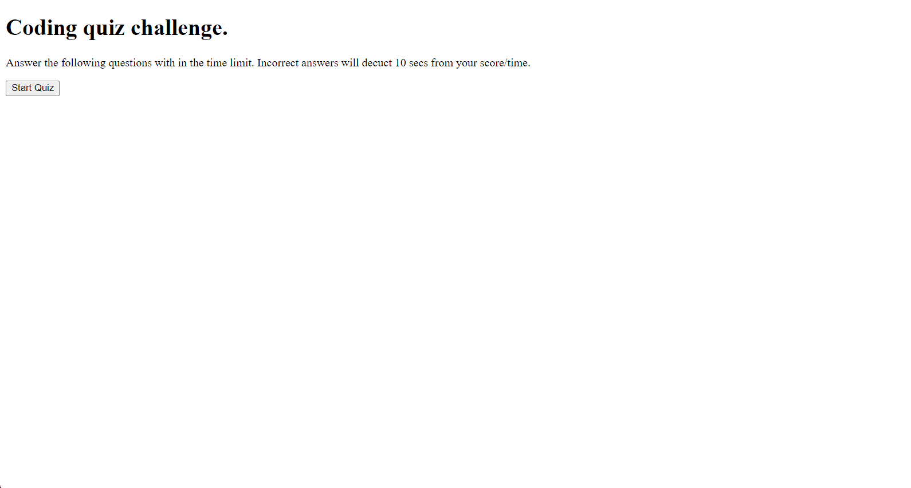

# Code Quiz

The goal of this assignment is to create a timed coding quiz with mulitple choice questions using JavaScript that dynamiclly updates the HTML and CSS.

Here is the link to the final version of the project.

[Click here to see my final project.](https://christopherrclark.github.io/code-quiz/)

